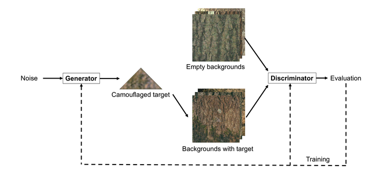
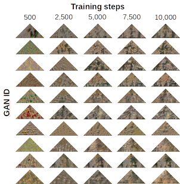

# CamoGAN

CamoGAN uses Generative Adversarial Networks to simulate an evolutionary arms race between camouflage of a synthetic prey and its predator. CamoGAN can be used to evolve progressively more effective concealment against an artificial predator.

[Paper](https://www.biorxiv.org/content/10.1101/429092v2)




## Prerequisites
Hardware
- Nvidia GPU with CUDA

OS
- Linux

Linux packages
- [graphviz](https://graphviz.gitlab.io/download/)

Nvidia libraries
- [CUDA](https://developer.nvidia.com/cuda-toolkit)
- [cuDNN](https://developer.nvidia.com/cudnn)

Python 3 libraries
- [keras](https://keras.io/) (tested with version 2.0.8)
- [matplotlib](https://pypi.org/project/matplotlib/)
- [numpy](https://pypi.org/project/numpy/)
- [opencv-python](https://pypi.org/project/opencv-python/)
- [Pillow](https://pypi.org/project/Pillow/)
- [pydot](https://pypi.org/project/pydot/)
- [tensorflow-gpu](https://www.tensorflow.org/install/gpu) (tested with version 1.4 and 1.14)

## Getting started
- Clone this repo
```
git clone https://gitlab.com/asb-lab/camogan.git
cd camogan
```
- Install prerequisites (note: that this will install a specific version of Keras - 2.0.8 - and tensorflow-gpu - 1.14.0)
```
sudo apt install graphviz
pip3 install -r requirements.txt
```
- Put background images in /backgrounds (optionally download the ones used in the paper)
```
mkdir ./backgrounds
wget https://www.dropbox.com/s/cmvjz4r02vzvjkv/treebark_ash_cropped15.zip -P ./backgrounds/
unzip ./backgrounds/treebark_ash_cropped15.zip -d ./backgrounds/
rm ./backgrounds/treebark_ash_cropped15.zip
```
- Set up paths and variables in options.py
- Train the model
```
python3 camogan.py
```
- Note: on rare occasions, we have seen the GAN get stuck in local minima in the beginning and no learning happens; in this case terminate and restart the script

## Citation
If you use this code for your research, please cite our paper
```
Talas, L., Fennell, J.G., Kjernsmo, K., Cuthill, I.C., Scott-Samuel, N.E. & Baddeley, R.J. CamoGAN: Evolving optimum camouflage with Generative Adversarial Networks. Methods in Ecology and Evolution. (Accepted).
```

## Acknowlegments
Our code is inspired by [DCGAN on MNIST using Keras](https://github.com/roatienza/Deep-Learning-Experiments/blob/master/Experiments/Tensorflow/GAN/dcgan_mnist.py).